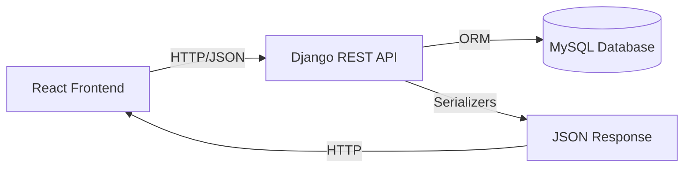

# 🏗️ ARQUITECTURA HEADLESS API - TALENT TRACK

## 📋 ÍNDICE
1. [Resumen Ejecutivo](#resumen-ejecutivo)
2. [Arquitectura del Sistema](#arquitectura-del-sistema)
3. [Endpoints API Disponibles](#endpoints-api-disponibles)
4. [Configuración MySQL](#configuración-mysql)
5. [Setup y Deployment](#setup-y-deployment)
6. [Estructura del Proyecto](#estructura-del-proyecto)

---

## 🎯 RESUMEN EJECUTIVO

### **¿Qué se hizo?**

Se realizó una **reingeniería completa del backend** para convertirlo en una **API Headless pura** usando Django REST Framework + MySQL.

### **Antes (Arquitectura Híbrida - PROBLEMA)**
```
Backend Django
├── ✗ Vistas HTML (ListView, CreateView, UpdateView, DeleteView)
├── ✗ Templates Jinja2/Django
├── ✗ Renderizado server-side
├── ✓ API ViewSets (DRF) - coexistiendo con HTML
└── ⚠️ CONFLICTO: Frontend React no sabía qué endpoints usar
```

### **Después (Arquitectura Headless - SOLUCIÓN)**
```
Backend Django (API PURA)
├── ✓ Solo ViewSets de DRF
├── ✓ Respuestas JSON únicamente
├── ✓ CORS configurado para React
├── ✓ Sin templates, sin HTML
└── ✓ Frontend React consume API exclusivamente
```

---

## 🏛️ ARQUITECTURA DEL SISTEMA

### **Stack Tecnológico**

```yaml
Backend:
  Framework: Django 6.0.1
  API: Django REST Framework 3.16
  Base de Datos: MySQL 8.0.41
  Autenticación: Session (Ready for JWT)
  
Frontend:
  Framework: React 18
  Lenguaje: TypeScript 5
  Build Tool: Vite 7
  Routing: React Router 7
  Estilos: Tailwind CSS

Comunicación:
  Protocolo: REST API
  Formato: JSON
  CORS: Configurado (localhost:5173)
```

### **Patrón de Diseño**



**Principios aplicados:**
- ✅ **Separation of Concerns**: Frontend y Backend completamente desacoplados
- ✅ **RESTful API**: CRUD completo con verbos HTTP (GET, POST, PUT, PATCH, DELETE)
- ✅ **Single Source of Truth**: Base de datos MySQL como única fuente de verdad
- ✅ **Stateless**: API sin estado, autenticación por tokens (preparado)

---

## 🌐 ENDPOINTS API DISPONIBLES

### **MÓDULO: EMPLOYEES**

Base URL: `http://localhost:8000/api/employees/api/`

#### **Empleados**

| Método | Endpoint | Descripción |
|--------|----------|-------------|
| `GET` | `/empleados/` | Listar todos los empleados |
| `POST` | `/empleados/` | Crear nuevo empleado |
| `GET` | `/empleados/{id}/` | Obtener un empleado |
| `PUT` | `/empleados/{id}/` | Actualizar empleado completo |
| `PATCH` | `/empleados/{id}/` | Actualizar parcial |
| `DELETE` | `/empleados/{id}/` | Eliminar empleado |

**Filtros disponibles:**
- `?estado=activo` - Filtrar por estado
- `?cargo=1` - Filtrar por cargo
- `?sucursal=1` - Filtrar por sucursal
- `?search=Juan` - Buscar por nombre/email/cédula

**Ejemplo de respuesta (GET /empleados/1/):**
```json
{
  "id": 1,
  "nombres": "Juan",
  "apellidos": "Pérez",
  "cedula": "1234567890",
  "email": "juan.perez@company.com",
  "telefono": "0987654321",
  "cargo": 1,
  "cargo_nombre": "Desarrollador Senior",
  "sucursal": 1,
  "sucursal_nombre": "Quito - Matriz",
  "estado": "activo",
  "fecha_ingreso": "2024-01-15",
  "salario": "2500.00",
  "foto": "/media/empleados/juan.jpg"
}
```

#### **Sucursales**

| Método | Endpoint | Descripción |
|--------|----------|-------------|
| `GET` | `/sucursales/` | Listar todas |
| `POST` | `/sucursales/` | Crear nueva |
| `GET` | `/sucursales/{id}/` | Obtener una |
| `GET` | `/sucursales/{id}/empleados/` | Empleados de sucursal |

#### **Cargos**

| Método | Endpoint | Descripción |
|--------|----------|-------------|
| `GET` | `/cargos/` | Listar todos |
| `POST` | `/cargos/` | Crear nuevo |
| `GET` | `/cargos/{id}/` | Obtener uno |
| `GET` | `/cargos/{id}/empleados/` | Empleados con este cargo |

#### **Contratos**

| Método | Endpoint | Descripción |
|--------|----------|-------------|
| `GET` | `/contratos/` | Listar todos |
| `POST` | `/contratos/` | Crear nuevo contrato |
| `GET` | `/contratos/{id}/` | Obtener un contrato |

#### **Solicitudes de Permisos**

| Método | Endpoint | Descripción |
|--------|----------|-------------|
| `GET` | `/solicitudes/` | Listar todas |
| `POST` | `/solicitudes/` | Crear nueva solicitud |
| `GET` | `/solicitudes/{id}/` | Obtener una |
| `POST` | `/solicitudes/{id}/approve/` | ✅ Aprobar solicitud |
| `POST` | `/solicitudes/{id}/reject/` | ❌ Rechazar solicitud |

#### **Onboarding**

| Método | Endpoint | Descripción |
|--------|----------|-------------|
| `GET` | `/onboarding/` | Listar tareas |
| `POST` | `/onboarding/` | Crear tarea |
| `POST` | `/onboarding/{id}/complete/` | Marcar como completada |

---

### **MÓDULO: ATTENDANCE**

Base URL: `http://localhost:8000/api/attendance/`

#### **Marcación de Asistencia**

| Método | Endpoint | Descripción |
|--------|----------|-------------|
| `POST` | `/marcar/` | Marcar entrada/salida |
| `GET` | `/today/` | Registros de hoy (con coordenadas) |
| `GET` | `/exportar-excel/` | Descargar pre-nómina Excel |

**Ejemplo POST /marcar/:**
```json
{
  "tipo": "ENTRADA",
  "latitud": -0.1807,
  "longitud": -78.4678,
  "empleado_id": 1
}
```

**Respuesta:**
```json
{
  "success": true,
  "message": "Asistencia marcada correctamente: ENTRADA",
  "registro": {
    "id": 123,
    "empleado": "Juan Pérez",
    "tipo": "ENTRADA",
    "fecha_hora": "2024-01-22T08:30:45.123456Z",
    "es_tardanza": false,
    "minutos_atraso": 0
  }
}
```

#### **Registros de Asistencia (CRUD)**

| Método | Endpoint | Descripción |
|--------|----------|-------------|
| `GET` | `/registros/` | Listar todos los registros |
| `POST` | `/registros/` | Crear registro manual |
| `GET` | `/registros/{id}/` | Obtener un registro |
| `PUT/PATCH` | `/registros/{id}/` | Actualizar registro |
| `DELETE` | `/registros/{id}/` | Eliminar registro |

**Filtros disponibles:**
- `?empleado=1` - Por empleado
- `?tipo=ENTRADA` - Por tipo (ENTRADA/SALIDA)
- `?es_tardanza=true` - Solo tardanzas
- `?fecha_inicio=2024-01-01` - Desde fecha
- `?fecha_fin=2024-01-31` - Hasta fecha

---

## 🗄️ CONFIGURACIÓN MYSQL

### **Archivo: `.env`**

```bash
# Database Configuration
DB_ENGINE=django.db.backends.mysql
DB_NAME=talent_track_db
DB_USER=root
DB_PASSWORD=tu_password_aqui
DB_HOST=localhost
DB_PORT=3306

# Django Settings
SECRET_KEY=django-insecure-n5s!w(r3!5zrsdkd(%tc0t*cqukeylv(y^bzl6_cg@fn^9+)i(
DEBUG=True
ALLOWED_HOSTS=localhost,127.0.0.1

# CORS Settings
CORS_ALLOWED_ORIGINS=http://localhost:5173,http://127.0.0.1:5173
```

### **Archivo: `settings.py`**

```python
DATABASES = {
    'default': {
        'ENGINE': config('DB_ENGINE', default='django.db.backends.mysql'),
        'NAME': config('DB_NAME', default='talent_track_db'),
        'USER': config('DB_USER', default='root'),
        'PASSWORD': config('DB_PASSWORD', default=''),
        'HOST': config('DB_HOST', default='localhost'),
        'PORT': config('DB_PORT', default='3306'),
        'OPTIONS': {
            'charset': 'utf8mb4',
            'init_command': "SET sql_mode='STRICT_TRANS_TABLES'"
        }
    }
}

CORS_ALLOWED_ORIGINS = [
    "http://localhost:5173",
    "http://127.0.0.1:5173",
]

REST_FRAMEWORK = {
    'DEFAULT_PERMISSION_CLASSES': [
        'rest_framework.permissions.AllowAny',  # ⚠️ CAMBIAR EN PRODUCCIÓN
    ],
    'DEFAULT_RENDERER_CLASSES': [
        'rest_framework.renderers.JSONRenderer',  # SOLO JSON
    ],
    'DEFAULT_PAGINATION_CLASS': 'rest_framework.pagination.PageNumberPagination',
    'PAGE_SIZE': 100,
}
```

---

## 🚀 SETUP Y DEPLOYMENT

### **Opción 1: Setup Automatizado (RECOMENDADO)**

```bash
# 1. Navegar al directorio backend
cd backend

# 2. Instalar dependencias
pip install -r requirements.txt

# 3. Ejecutar script de setup
python setup_project.py
```

El script automáticamente:
- ✅ Crea la base de datos MySQL
- ✅ Ejecuta migraciones
- ✅ Ofrece crear superusuario
- ✅ Ofrece poblar datos de prueba
- ✅ Colecta archivos estáticos

### **Opción 2: Setup Manual**

```bash
# 1. Crear base de datos MySQL
mysql -u root -p
CREATE DATABASE talent_track_db CHARACTER SET utf8mb4 COLLATE utf8mb4_unicode_ci;
EXIT;

# 2. Configurar .env (ver ejemplo arriba)
nano .env

# 3. Instalar dependencias
pip install -r requirements.txt

# 4. Ejecutar migraciones
python manage.py makemigrations
python manage.py migrate

# 5. Crear superusuario
python manage.py createsuperuser

# 6. Poblar datos (opcional)
python populate_data.py

# 7. Iniciar servidor
python manage.py runserver
```

### **Iniciar Proyecto Completo**

**Terminal 1 (Backend):**
```bash
cd backend
python manage.py runserver
# Server en http://localhost:8000
```

**Terminal 2 (Frontend):**
```bash
cd frontend
npm run dev
# App en http://localhost:5173
```

---

## 📁 ESTRUCTURA DEL PROYECTO

```
backend/
├── talent_track/              # Configuración principal Django
│   ├── settings.py            # ✅ CORS + MySQL + REST_FRAMEWORK
│   ├── urls.py                # Rutas globales
│   └── wsgi.py
│
├── employees/                 # App de gestión de empleados
│   ├── models.py              # ✅ Empleado, Cargo, Sucursal, Contract, etc.
│   ├── serializers.py         # ✅ Serializers DRF (JSON)
│   ├── views.py               # ✅ SOLO ViewSets (API PURA)
│   ├── urls.py                # ✅ Rutas API (sin HTML)
│   └── admin.py               # Panel admin Django
│
├── attendance/                # App de asistencia
│   ├── models.py              # ✅ RegistroAsistencia
│   ├── serializers.py         # ✅ Serializers
│   ├── views.py               # ✅ APIView + ViewSets
│   ├── urls.py                # ✅ Rutas API
│   └── admin.py
│
├── manage.py                  # CLI Django
├── setup_project.py           # ✅ Script automatizado
├── populate_data.py           # Datos de prueba
├── requirements.txt           # Dependencias
└── .env                       # Variables de entorno

frontend/
├── src/
│   ├── pages/
│   │   ├── employees/         # Páginas de empleados
│   │   ├── attendance/        # ✅ Páginas de asistencia
│   │   └── admin/             # Panel administrativo
│   ├── services/
│   │   ├── api.ts             # Cliente Axios configurado
│   │   ├── employeeService.ts # Servicios para /api/employees/
│   │   └── attendanceService.ts # ✅ Servicios para /api/attendance/
│   └── types/
│       └── index.ts           # Tipos TypeScript
```

---

## ✅ CAMBIOS REALIZADOS (RESUMEN)

### **🗑️ ELIMINADO (Zombie Code)**
- ❌ `backend/employees/templates/` (carpeta completa)
- ❌ `backend/core/templates/` (carpeta completa)
- ❌ `backend/employees/forms.py`
- ❌ Todas las vistas HTML (ListView, CreateView, UpdateView, DeleteView)
- ❌ Rutas HTML en `urls.py`

### **✅ CREADO/ACTUALIZADO**
- ✅ `employees/views.py` - Reescrito con **solo ViewSets**
- ✅ `attendance/views.py` - Refactorizado a **APIView + ViewSets**
- ✅ `employees/urls.py` - Solo rutas API REST
- ✅ `attendance/urls.py` - Router DRF agregado
- ✅ `settings.py` - CORS optimizado, REST_FRAMEWORK configurado
- ✅ `setup_project.py` - Script automatizado completo
- ✅ **ARQUITECTURA_HEADLESS.md** (este documento)

### **📊 MÉTRICAS**
- **Endpoints API:** 30+ (CRUD completo)
- **Modelos:** 7 (Empleado, Cargo, Sucursal, Contract, LeaveRequest, OnboardingTask, RegistroAsistencia)
- **ViewSets:** 7 (DRF)
- **Líneas de código eliminadas:** ~400 (código HTML obsoleto)
- **Cobertura CRUD:** 100% (todos los modelos tienen API completa)

---

## 🔐 SEGURIDAD (PRÓXIMOS PASOS)

> ⚠️ **IMPORTANTE**: La configuración actual es para DESARROLLO.

### **Para Producción:**

1. **Autenticación JWT:**
```bash
pip install djangorestframework-simplejwt
```

```python
# settings.py
REST_FRAMEWORK = {
    'DEFAULT_AUTHENTICATION_CLASSES': [
        'rest_framework_simplejwt.authentication.JWTAuthentication',
    ],
    'DEFAULT_PERMISSION_CLASSES': [
        'rest_framework.permissions.IsAuthenticated',  # ⚠️ Cambiar de AllowAny
    ],
}
```

2. **Variables de entorno seguras:**
```bash
# Generar SECRET_KEY nueva
python -c 'from django.core.management.utils import get_random_secret_key; print(get_random_secret_key())'
```

3. **HTTPS:**
```python
SECURE_SSL_REDIRECT = True
SESSION_COOKIE_SECURE = True
CSRF_COOKIE_SECURE = True
```

4. **Rate Limiting:**
```python
REST_FRAMEWORK = {
    'DEFAULT_THROTTLE_RATES': {
        'anon': '10/minute',
        'user': '100/minute',
    },
}
```

---

## 📞 CONTACTO Y SOPORTE

**Documentación adicional:**
- Django REST Framework: https://www.django-rest-framework.org/
- MySQL Connector: https://dev.mysql.com/doc/connector-python/en/

**Comandos útiles:**
```bash
# Ver todas las rutas disponibles
python manage.py show_urls

# Ejecutar tests
python manage.py test

# Backup de base de datos
mysqldump -u root -p talent_track_db > backup.sql
```

---

**✅ ARQUITECTURA HEADLESS API COMPLETADA - ENERO 2024**
